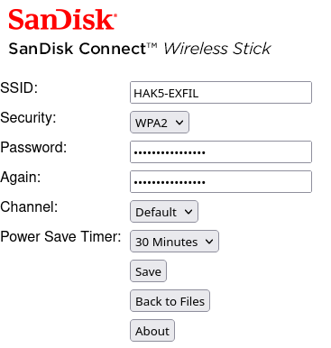

# Files Exfiltration with "SanDisk Wireless Stick"

- Title:         "SanDisk Wireless Stick" Exfiltration
- Author:        TW-D
- Version:       1.0
- Target:        Microsoft Windows 10
- Category:      Exfiltration

## Description

Uses the "SanDisk Wireless Stick" for files exfiltration.
1) Avoids "PowerShell Script Block Logging".
2) Hide "PowerShell" window.
3) Deletes Wi-Fi connection profiles in automatic mode, each deletion causes a disconnection.
4) Adds the profile for the "SanDisk Connect Wireless Stick" in automatic mode.
5) Checks whether the Wi-Fi interface is connected to the "SanDisk" and whether the gateway can be reached, if not, automatically starts again.
6) Exfiltration of the files via the HTTP channel.

## Configuration

In the web interface of the "SanDisk Wireless Stick" after update, change the following values :



From "payload.txt" change the values of the following constants :
```bash
######## INITIALIZATION ########

readonly BB_LABEL="BashBunny"

readonly SANDISK_SSID="HAK5-EXFIL"
readonly SANDISK_PSK="MyS3cr3TP@sSw0rD"
readonly SANDISK_LOOT="loots"
readonly USER_DIRECTORY="~\\"
readonly FILE_EXTENSION="*.txt,*.pdf,*.docx"

```

## Link
[SanDisk Vendor](https://www.sandisk.com/goto/connect)
