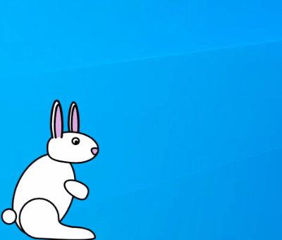

# Desktop Bunny
- Author: Cribbit
- Version: 1.0
- Target: Windows 10 (Powershell 5.1+) + .net wpf
- Category: Pranks
- Attackmode: HID & Storage

## Change Log
| Version | Changes         |
| ------- | --------------- |
| 1.0     | Initial release |

## Description
Shows a bunny that move along the bottom of the screen.

Creates a WPF window which is inviable apart form an image of a bunny.
Then the script moves the window along the bottom of the screen. 
When it reaches the far side it flips the image and move the bunny in the opposite direction.

## How to get ride of the bunny
Right Click on the bunny will close the window.

## Colours
| Status   | Colour                        | Description                 |
| -------- | ----------------------------- | --------------------------- |
| SETUP    | Magenta solid                 | Setting attack mode         |
| ATTACK   | Yellow single blink           | Injecting Keystrokes 		 |
| FINISHED | Green blink followed by SOLID | Injection finished          |