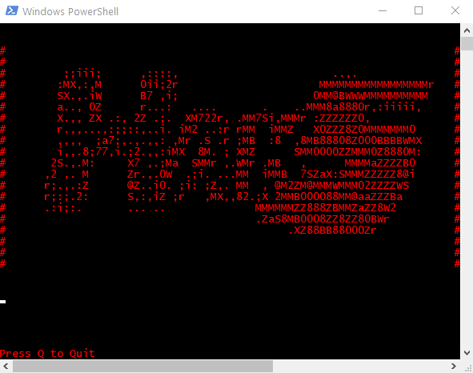

# Spinning Around
- Author: Cribbit
- Version: 1.0
- Target: Windows (Powershell 5.1+)
- Category: Pranks
- Attackmode: HID & RNDIS_ETHERNET
- Extensions: Run

## Change Log
| Version | Changes         |
| ------- | --------------- |
| 1.0     | Initial release |

## Description
Spinning Ascii Hak5 Logo in a powershell window\

## Props
To TW-D for the inspiration, audibleblink for python server code "execution/ShellExec/payload.txt" and
Super mad props to Lee Holmes for Powershell Rickroll for the animation code.
https://www.leeholmes.com/powershell-and-html5/

## Colours
| Status   | Colour                        | Description                 |
| -------- | ----------------------------- | --------------------------- |
| SETUP    | Magenta solid                 | Setting attack mode         |
| ATTACK   | Yellow single blink           | Injecting Powershell script |
| FINISHED | Green blink followed by SOLID | Injection finished          |
